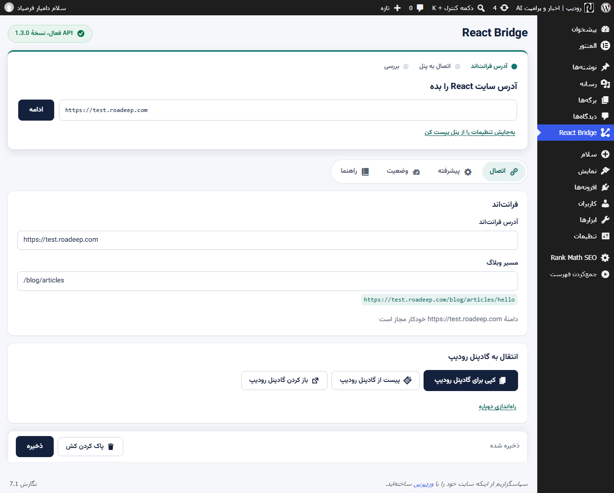
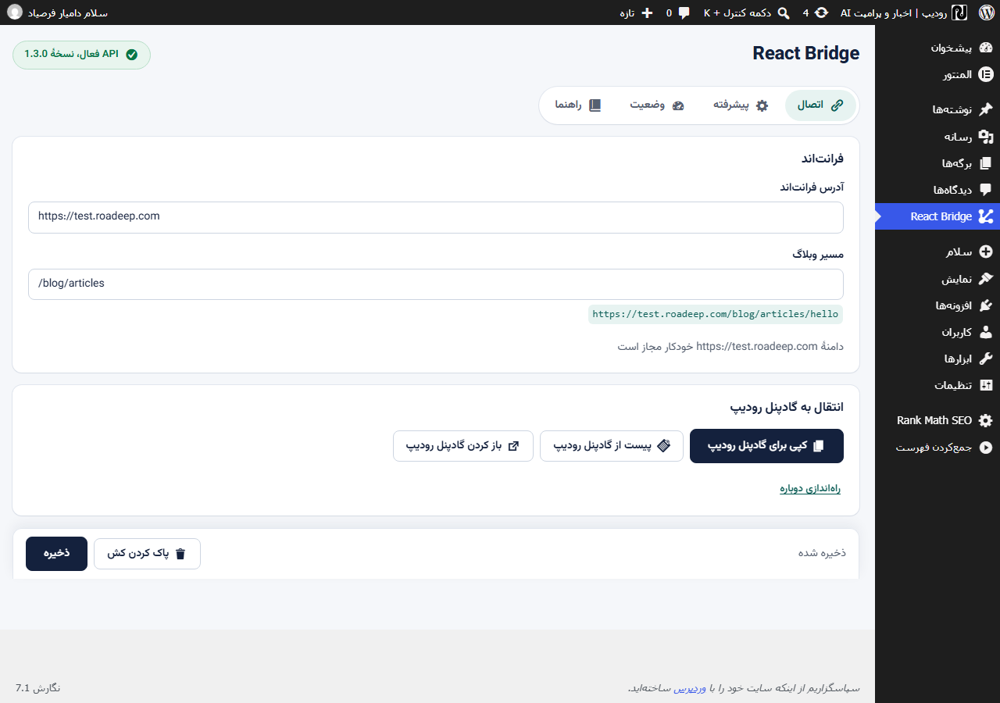
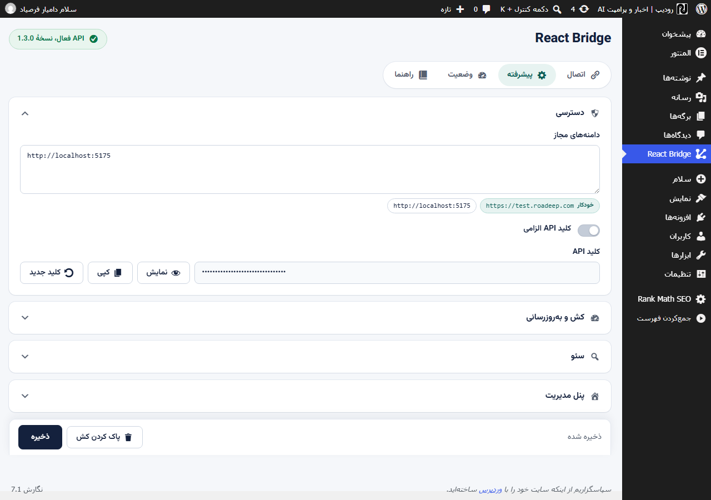
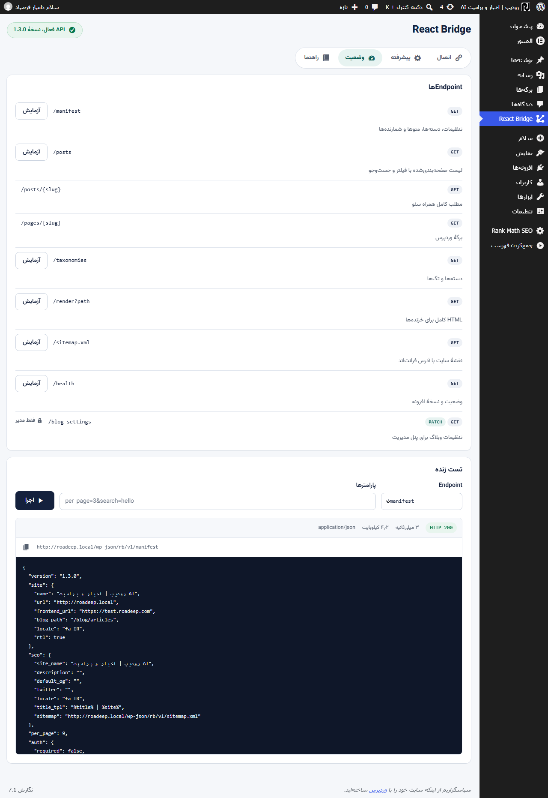
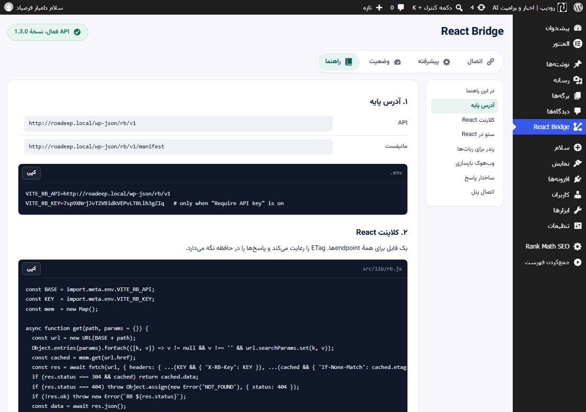
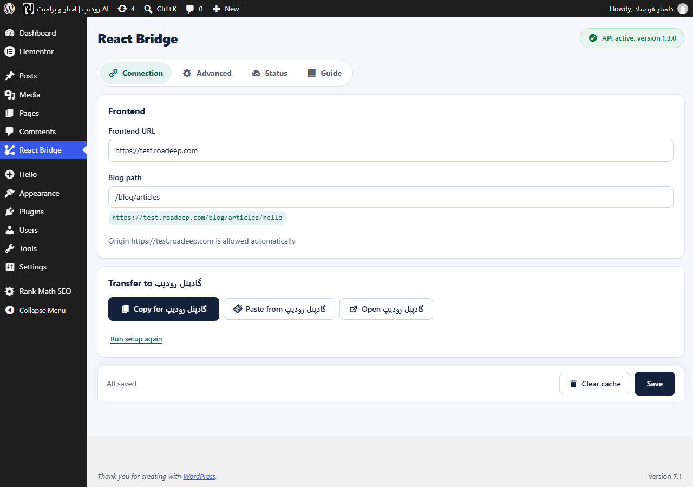
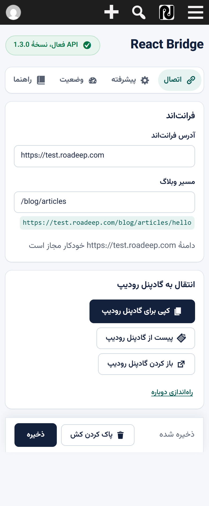

[English](README.md) | [فارسی](README.fa.md)

<div dir="rtl">

# React Bridge

وردپرس را به یک منبع محتوای هدلس برای هر فرانت‌اند React یا جاوااسکریپت تبدیل می‌کند. همه چیز از یک فضای نام REST به نام `rb/v1` بیرون می‌آید: نوشته‌ها، برگه‌ها، دسته‌ها و برچسب‌ها، منوها، سئوی هر نوشته (متا، Open Graph و JSON-LD)، خروجی HTML آماده برای خزنده‌ها، نقشه سایت، کش سمت سرور با ETag و یک وب‌هوک امضاشده برای بازاعتبارسنجی.

## تصویرها

<table>
  <tr>
    <td width="49%"></td>
    <td width="49%"></td>
  </tr>
  <tr>
    <td width="49%"></td>
    <td width="49%"></td>
  </tr>
  <tr>
    <td width="49%"></td>
    <td width="49%"></td>
  </tr>
</table>



## امکانات

- **API محتوا**: `/posts` با صفحه‌بندی و فیلتر، `/posts/{slug}`، `/pages/{slug}`، `/taxonomies`، `/manifest` و `/health`.
- **سئوی آماده**: هر نوشته یک شیء `seo` و `head_html` کامل دارد و مقدارهای دستی را از متاباکس افزونه، Yoast یا Rank Math می‌خواند.
- **رندر برای خزنده‌ها**: `/render?path=` برای ربات‌ها HTML کامل برمی‌گرداند. نمونه پیکربندی nginx در تب راهنما هست.
- **نقشه سایت** با آدرس‌های فرانت‌اند، تا ۵۰٬۰۰۰ ورودی، با رعایت noindex.
- **کش**: کش ترنزینت با شمارنده نسل، هدرهای `Cache-Control` و `ETag` و پاسخ `304`. کش فقط با تغییرهای مرتبط خالی می‌شود.
- **وب‌هوک**: رویدادهای `publish`، `update`، `unpublish` و `delete` با امضای HMAC-SHA256، هر نوشته در هر درخواست یک بار.
- **قرارداد پنل مدیریت**: `GET/PATCH /blog-settings` برای یک پنل مدیریت بیرونی با احراز هویت Application Password، به‌همراه کپی و چسباندن یک‌کلیکی تنظیمات بین وردپرس و پنل شما.
- **راه‌اندازی سریع**: آدرس فرانت‌اند را وارد می‌کنید، افزونه مبدأ آن را مجاز می‌کند، در دسترس بودنش را می‌سنجد و اتصال را بررسی می‌کند.
- **مستقل از قالب و سرویس**: کاملاً قابل ترجمه، با ترجمه فارسی همراه، جهت متن را از سایت می‌گیرد و هیچ فرضی درباره سرویس خاصی ندارد.

## پیش‌نیازها

وردپرس ۶٫۲ به بالا و PHP نسخه ۸٫۰ به بالا.

## نصب

۱. فایل zip نسخه را دانلود کنید، یا این مخزن را در مسیر `wp-content/plugins/react-bridge` کلون کنید.

۲. افزونه **React Bridge** را در بخش افزونه‌ها فعال کنید.

۳. از منوی مدیریت وارد **React Bridge** شوید و راه‌اندازی سریع را دنبال کنید.

## شروع سریع

راه‌اندازی سریع سه گام دارد و تا وقتی آدرس فرانت‌اند خالی باشد یا هنوز به همین وردپرس اشاره کند، خودش باز می‌شود.

۱. **آدرس فرانت‌اند**: نشانی سایت React خود را وارد کنید، مثلاً `https://example.com`. افزونه مبدأ آن را به فهرست مبدأهای مجاز اضافه می‌کند و در دسترس بودنش را بررسی می‌کند.

۲. **اتصال پنل**: دکمه کپی تنظیمات، همه تنظیمات وبلاگ را به شکل JSON در کلیپ‌بورد می‌گذارد تا در پنل خود «چسباندن از افزونه» را بزنید. مسیر برعکس هم هست: در کارت «انتقال به پنل» در تب اتصال، متن تنظیمات پنل را می‌چسبانید و افزونه آن را از همان مسیر اعتبارسنجی‌شده اعمال می‌کند.

۳. **بررسی**: چهار تست API، مانیفست، نوشته‌ها و نقشه سایت اجرا می‌شود تا از سالم بودن اتصال مطمئن شوید.

صفحه مدیریت چهار تب دارد: اتصال، پیشرفته، وضعیت با تست زنده اندپوینت‌ها، و راهنما که کد آماده دارد، شامل یک کلاینت fetch با پشتیبانی ETag، هوک React، صفحه فهرست و صفحه مقاله، کامپوننت سئو و بلاک nginx برای رندر خزنده‌ها.

## قرارداد پنل مدیریت

اندپوینت مخصوص مدیر برای خواندن و تغییر هفت تنظیم وبلاگ:

- `GET /wp-json/rb/v1/blog-settings` هر هفت کلید را برمی‌گرداند، با هدر `Cache-Control: no-store`.
- `PATCH /wp-json/rb/v1/blog-settings` به‌روزرسانی جزئی با بدنه JSON است و پس از ذخیره، هفت کلید را برمی‌گرداند. کلاینتی که PATCH نمی‌فرستد می‌تواند POST با هدر `X-HTTP-Method-Override: PATCH` بفرستد.

احراز هویت با کاربری که دسترسی `manage_options` دارد: یا Application Password روی HTTP Basic و ترجیحاً HTTPS، یا کوکی ورود به‌همراه `X-WP-Nonce`. کلید عمومی `X-RB-Key` اینجا پذیرفته نمی‌شود. درخواست ناشناس پاسخ ۴۰۱ و کاربر بدون دسترسی پاسخ ۴۰۳ می‌گیرد.

هفت کلید:

| کلید | نوع | توضیح |
| --- | --- | --- |
| `frontend_url` | رشته | خالی یا آدرس مطلق http یا https، بدون اسلش پایانی، کوئری و فرگمنت. |
| `blog_path` | رشته | با `/` شروع می‌شود، بدون اسلش پایانی و بدون فاصله. پیش‌فرض `/blog`. |
| `redirect_to_frontend` | بولی | برگه‌های قدیمی وردپرس با ۳۰۱ به فرانت‌اند می‌روند. |
| `cors_origins` | آرایه رشته | هرکدام دقیقاً `scheme://host[:port]`، بدون مسیر، حداکثر ۵۰ مورد، بدون `*`. |
| `cache_ttl_seconds` | عدد صحیح | بین ۰ تا ۸۶۴۰۰، عمر `Cache-Control` و ETag. صفر یعنی بدون کش. |
| `posts_per_page` | عدد صحیح | بین ۱ تا ۵۰، پیش‌فرض ۱۰. |
| `revalidate_webhook_url` | رشته | خالی یا آدرس مطلق http یا https برای دریافت POST امضاشده. |

نوع‌ها سخت‌گیرانه بررسی می‌شوند، یعنی `"1"` یا `"300"` رد می‌شود. اعتبارسنجی اتمیک است: اگر حتی یک فیلد نامعتبر باشد چیزی ذخیره نمی‌شود و پاسخ ۴۰۰ با خطای هر فیلد برمی‌گردد. بدنه‌ای که شیء JSON نباشد `rb_invalid_body` می‌گیرد. کلیدهای ناشناخته نادیده گرفته و در هدر `X-RB-Ignored-Fields` فهرست می‌شوند. هر به‌روزرسانی موفق یک خط در لاگ خطای PHP می‌نویسد که شناسه کاربر و نام کلیدهای تغییرکرده را دارد، نه مقدارها را.

## توسعه

```bash
# اجرای تست‌های CLI روی یک نصب محلی وردپرس
php tests/run.php /path/to/wordpress

# ساخت دوباره ترجمه‌ها پس از تغییر رشته‌های منبع
php tools/extract-pot.php
php tools/make-mo.php languages/react-bridge-fa_IR.po
```

تست‌ها فقط از خط فرمان اجرا می‌شوند و افزونه باید فعال باشد. مقدار `rb_settings` پیش از شروع ذخیره و پس از هر تست بازگردانده می‌شود.

## پروانه

GPL-2.0-or-later. متن کامل در [LICENSE](LICENSE).

</div>
